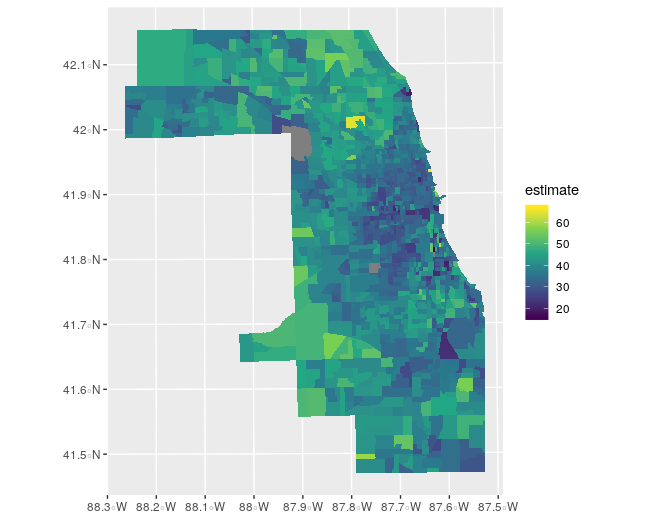

# crsuggest

{crsuggest} is a small R package to help spatial analysts determine an appropriate projected coordinate reference system for their data.  It implements one core function, `suggest_crs()` that attempts to match an input spatial dataset with corresponding coordinate reference systems that will work well for mapping and/or spatial analysis.  The package is inspired by the more cleverly-named [projestions API](https://github.com/ebrelsford/projestions) and [companion QGIS plugin](https://github.com/ebrelsford/qgis-projestions). 

Install from GitHub with the following command in R:

```r
remotes::install_github("walkerke/crsuggest")
```

Consider the following common use cases in R:

### Use case 1: Analyzing unprojected data

Let's say you've obtained a points dataset in a geographic coordinate system and you'd like to draw buffers around those points:

```r
library(tigris)
library(sf)
options(tigris_class = "sf")

tx_landmarks <- landmarks("TX")

landmark_buf <- st_buffer(tx_landmarks, 1)
```
```
# The message:
dist is assumed to be in decimal degrees (arc_degrees).
Warning message:
In st_buffer.sfc(st_geometry(x), dist, nQuadSegs, endCapStyle = endCapStyle,  :
  st_buffer does not correctly buffer longitude/latitude data
```

`st_buffer()` is telling us that we need a projected coordinate system.  But how do we figure out the right one for our data?  For local areas (e.g. a US state) there are a number of options designed to minimize distortion for that area.  `suggest_crs()` aims to put these options at your fingertips.  

```r
library(crsuggest)

possible_crs <- suggest_crs(tx_landmarks)

dplyr::glimpse(possible_crs)
```
```
Observations: 10
Variables: 7
$ area_code <chr> "1412", "1412", "1412", "1412", "1412", "14…
$ crs_type  <chr> "projected", "projected", "projected", "pro…
$ crs_code  <chr> "3080", "3081", "3082", "3083", "3084", "30…
$ crs_name  <chr> "NAD27 / Shackleford", "NAD83 / Texas State…
$ crs_gcs   <chr> "4267", "4269", "4269", "4269", "4152", "41…
$ crs_units <chr> "ft", "m", "m", "m", "m", "m", "m", "m", "m…
$ crs_proj4 <chr> "+proj=lcc +lat_0=31.1666666666667 +lon_0=-…
```

By default, `suggest_crs()` returns the top 10 matches for a given input spatial dataset.  From here, you can browse the returned CRS options, select an appropriate entry, and use the EPSG or proj4string codes in your analysis.  For example, we can now choose a coordinate system, transform, and re-run: 

```r
landmarks_projected <- st_transform(tx_landmarks, 3081)

buffer_1km <- st_buffer(landmarks_projected, 1000)
```

### Use case 2: Customizing arguments

Let's say you've obtained a spatial dataset, but you already know you want a projected coordinate system with a specific geographic coordinate system (e.g. NAD 1983, EPSG code 4269) and specific measurement units (US Feet).  `suggest_crs()` has `gcs` and `units` parameters that allow subsetting in this way.

```r
library(tidycensus)
library(ggplot2)
library(sf)

# Median age by Census tract in Cook County, Illinois
cook_age <- get_acs(geography = "tract",
                    variables = "B01002_001",
                    state = "IL",
                    county = "Cook County",
                    geometry = TRUE)
                    
cook_crs <- suggest_crs(cook_age, gcs = 4269, units = "us-ft")

dplyr::glimpse(cook_crs)
```
```
Observations: 2
Variables: 7
$ area_code <chr> "2194", "3641"
$ crs_type  <chr> "projected", "projected"
$ crs_code  <chr> "3435", "32166"
$ crs_name  <chr> "NAD83 / Illinois East (ftUS)", "NAD83 / BL…
$ crs_gcs   <chr> "4269", "4269"
$ crs_units <chr> "us-ft", "us-ft"
$ crs_proj4 <chr> "+proj=tmerc +lat_0=36.6666666666667 +lon_0…
```

We get two options to choose from; one in the State Plane system and the other in the BLM system.  We can use the State Plane Illinois East CRS in plotting functions like `coord_sf()`:

```                       
ggplot(cook_age, aes(fill = estimate)) + 
  geom_sf(color = NA) + 
  coord_sf(crs = 3435) + 
  scale_fill_viridis_c()
```



### Potential questions: 

* __You only show examples from the United States.  Does it work worldwide?__ Yes, it _should_ work around the world though I've noticed some problems with areas that cross the date line, and I haven't thoroughly tested everwhere.  Please file an issue if something isn't working correctly.  
* __Can I use this safely to automate projection decisions in production data pipelines?__ I'd advise against it; I see this more as a "look-up" tool to help you make informed decisions.  Research the coordinate system you plan to use - and how it handles distortion of your data - before settling on it for use in production.  
* __Will there be a CRAN release?__ Not at this time; the look-up dataset used is too large to publish to CRAN and I haven't yet determined an alternative solution.  I'm welcome to suggestions, however.  
